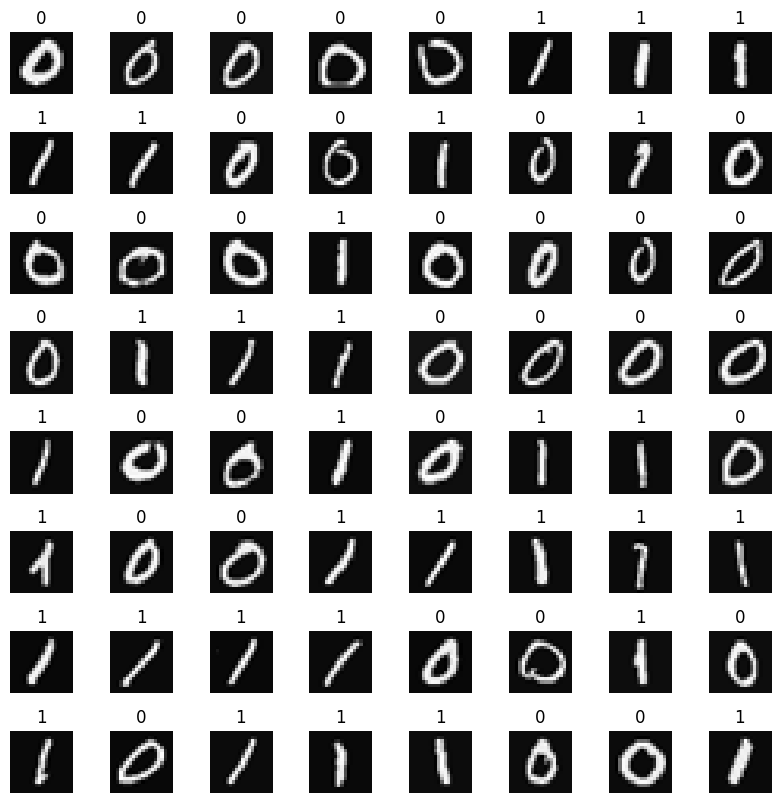

# Handwritten Digit Recognition
neural network concept is used to recognize the hand-written digits zero and one.

The data set is a subset of **MNIST** data set. The data set is used for training the model.  
The subset of dataset is as follows:  

