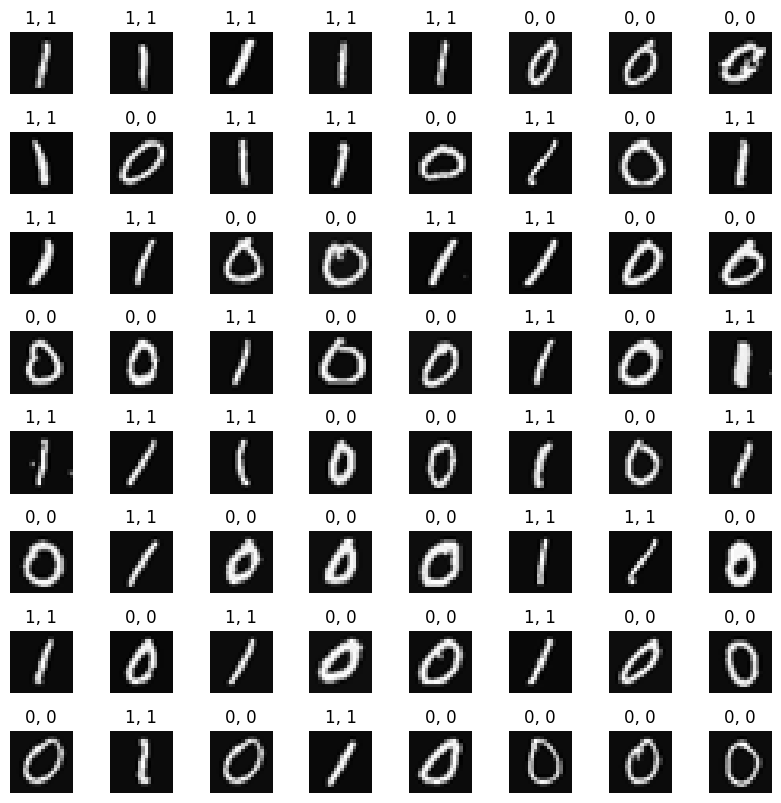

# Handwritten Digit Recognition
neural network concept is used to recognize the hand-written digits zero and one.

The data set is a subset of **MNIST** data set. The data set is used for training the model.  
The subset of dataset is as follows:  

  

The neural network model structure created by TensorFlow is like this:  
  

When the model compiled, fitted the dataset and finally trained, it is now capable of making predictions:  
  

